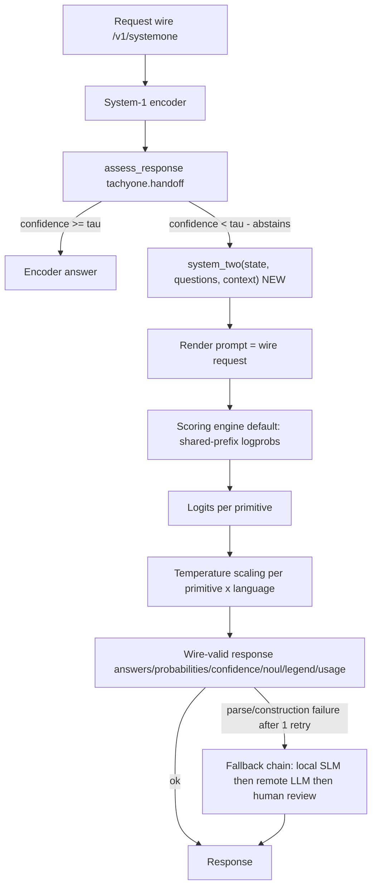

# system-two-integration — Design

**Spec:** `.specs/features/system-two-integration/spec.md`
**Status:** Draft (pending maintainer approval before Tasks/Execute phases)
**PRD source:** `docs/tachyone_prd.md` v1.1.0 §1.2, §3.4, §3.5, §5.1–§5.4
**Broader architecture:** `docs/architecture.md`

---

## Architecture Overview

The SLM plugs into the existing handoff seam as an **additive, client-side** implementation of `system_two()`. The wire (`/v1/systemone`) and System-1 are untouched; only the empty slot described by `cookbook-handoff.md` gets a real implementation.



**Default data path (§3.4):** ~0 generated tokens — the answer is assembled from scored logits, which is what makes p50 < 20 ms (and the < 8 ms stretch with FP8@L4) plausible.

---

## Code Reuse Analysis

### Existing components to leverage (repo `munod/tachyone`)

| Component | Location | How to use |
| --- | --- | --- |
| Handoff mechanism | `src/tachyone/handoff.py` | Consume `HandoffReport`; do not modify |
| Handoff cookbook example | `docs/cookbook-handoff.md` | Migrate from stub to real implementation (§5.2) |
| Wire contract + tests | `docs/protocol.md`, `tests/test_contract_wire.py` | Frozen reference; suite must stay untouched & green |
| Calibration | `src/tachyone/calibration.py`, `training/fit_calibration.py` | Temperature scaling per (primitive, language) |
| Remote LLM backend | `src/tachyone/backends/llm.py` | Fallback chain step 2 |
| Data pipeline | `training/generate_data.py`, `training/configs/data_sft_slm.json` | SFT pairs rendered as wire prompts (Phase 1) |
| Benchmark harness | `benchmarks/compare.py` | `JSON ok` + latency evidence (Phase 5) |
| Fast-path pattern | `src/tachyone/fast.py` (ADR-0012) | Pattern reference only — it belongs to the encoder |

### Integration points

| System | Integration method |
| --- | --- |
| System-1 / handoff | Consume `HandoffReport` read-only (B-3 client-side pattern) |
| SDK / CLI | Export `tachyone.system_two`; add CLI flag (§5.2) |
| Serving engines | Embedded (transformers/peft) default; vLLM/TRT-LLM optional per ADR-0017 (§5.2) |
| Wire | Same request/response JSON — zero new fields (ADR-0001) |

---

## Components

### `system_two(state, questions, context)`

- **Purpose:** Official implementation of the System-2 slot: answer abstained items within the frozen wire contract.
- **Location:** `src/tachyone/` (exact module per repo conventions at implementation time — not decided in this workspace).
- **Interfaces:** `system_two(state: str, questions: dict, context: HandoffReport | None) -> wire response` (shape fixed by `docs/protocol.md`).
- **Dependencies:** exported model artifact (Phase 3), calibration assets (this phase), τ configuration.
- **Reuses:** `tachyone.handoff`, `calibration.py`.

### Scoring engine (default mode)

- **Purpose:** Build `choice`/`score`/`noul` answers from logits without free generation.
- **Interfaces:** shared-prefix batch scoring; `softmax(logprobs)` for `choice`/`score`; `sigmoid(ℓ(true) − ℓ(false))` for `noul`; expected value `Σ i·pᵢ` for `score`.
- **Dependencies:** tokenizer/template with shared `system`/`task`/`questions` prefix (enables prefix caching, §4.3).
- **Reuses:** wire schema as post-hoc verifier (§5.4).

### Constrained-generation mode (experimental, opt-in)

- **Purpose:** Generate only the values of the `answers` wrapper under the contract grammar; allow a discarded scratchpad.
- **Interfaces:** grammar/JSON Schema from the contract (XGrammar/llguidance or vLLM `guided_json`); runtime assembles final JSON; probabilities via rescoring.
- **Dependencies:** Phase 3 engine with guided decoding support.
- **Reuses:** §5.4 schema (also the annex of ADR-0017).

### Calibration layer

- **Purpose:** Fit/apply temperature scaling so `confidence`/`probabilities` are calibrated.
- **Interfaces:** per (primitive, language) temperature; grid 0.25–20.00 step 0.05; fit on train-split val only.
- **Reuses:** `training/fit_calibration.py`, `calibration.py`; B-8 loud-warning fallback.

### τ / retry / fallback policy

- **Purpose:** Route and fail explicitly.
- **Interfaces:** τ configurable (no universal default; ref 0.6); ≤ 1 retry; chain SLM → remote LLM → human, explicit in the `handoff` diagnostic object.
- **Reuses:** `backends/llm.py` as chain step 2; existing CLI diagnostics.

---

## Data Models

Responses follow the frozen wire (PRD §5.1) — no new schema is defined here:

```json
{
  "model": "tachyone-latest",
  "answers": {
    "<key>": {
      "type": "choice | score | noul",
      "choice": "…", "score": 2.03, "noul": 0.02,
      "probabilities": { "…": 0.0 },
      "confidence": 0.97,
      "legend": { "0": "…" }
    }
  },
  "usage": { "input_tokens": 214, "output_tokens": 0 }
}
```

**Relationships:** `answers` keys ≡ `questions` keys; `probabilities` keys ≡ options/indices; `legend` ≡ score `criteria`; `noul` ∈ [0,1].

---

## Error Handling Strategy

| Error scenario | Handling | User impact |
| --- | --- | --- |
| Parse/construction failure | 1 retry, then fallback chain — never silent (§5.3) | Valid answer via chain, chain visible in diagnostics |
| Calibration asset unreadable | Warn **by name**, no silent degradation (B-8) | Loud, attributable failure |
| `probabilities` drift ≠ 1.0 | Normalize or reject before returning | Invariant preserved |
| τ not configured | Clear configuration error (no universal default) | Operator sets τ (cookbook guidance) |
| Engine/model artifact missing | Explicit error naming the artifact | Fail fast instead of wrong answers |
| Remote LLM also fails | Chain ends in human review, explicitly reported | No fabricated confidence |

---

## Tech Decisions (non-obvious)

| Decision | Choice | Rationale |
| --- | --- | --- |
| Default decoding | Candidate scoring | §3.4 / DEC-001: compliance by construction, stable cost with 255 options, native distributions |
| Composition style | Client-side, additive | §5.2 / B-3: keeps wire frozen (ADR-0001) |
| Calibration scope | Per (primitive, language) | §3.5: pooled temperature hides per-cell miscalibration |
| Fit split | Train-split validation only | §3.5: eval sets frozen (§8 contamination risk) |
| Scratchpad | Allowed only in experimental mode, discarded by runtime | §3.4: default path must emit ~0 tokens |
