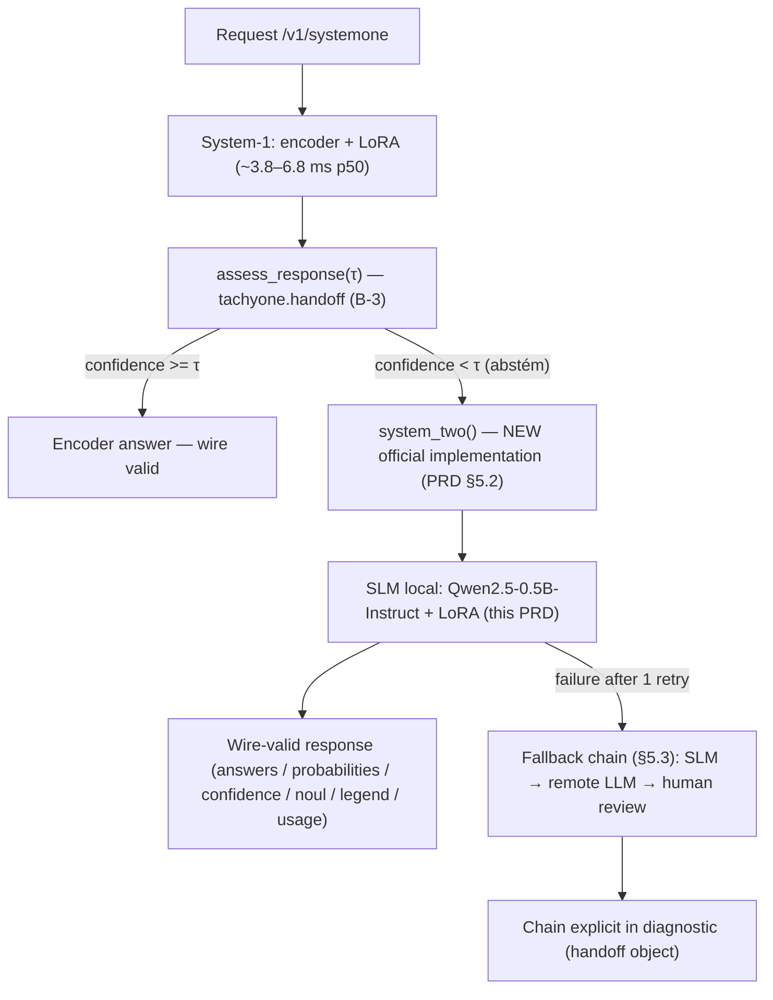
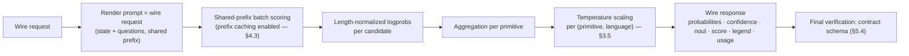
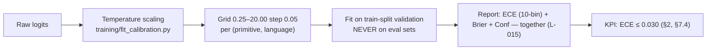
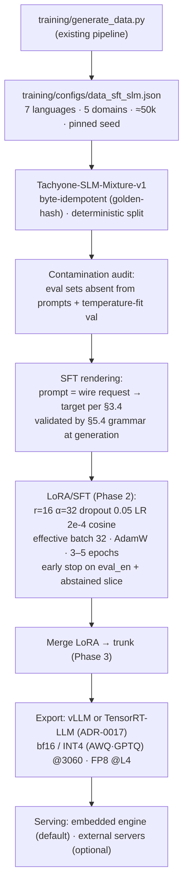

# Architecture — TachyOne SLM (System-2 Local)

> Derived from **PRD v1.2.0** (`tachyone_prd.md`) §1, §3, §4, §5. No numbers are invented here — measurements come from `phase0-baseline.md` (Phase 0) or are marked *to be measured (Phase 4/5)*.
> Target code repository: [`munod/tachyone`](https://github.com/munod/tachyone).

---

## 1. The hybrid: System-1 / System-2

Tachyone answers in two stages. **System-1** (encoder: ModernBERT/mmBERT + LoRA) is fast (~3.8–6.8 ms p50) but does not reason. When its confidence falls below the threshold τ, it **abstains** and hands the item to **System-2** — the local SLM specified here.

**Invariants**

- The wire `/v1/systemone` is **frozen** (ADR-0001): `tests/test_contract_wire.py` stays green **unchanged** (§1.4).
- System-1 is **untouched** — no encoder change, no retraining (§1.4).
- `system_two()` is **client-side and additive** (B-3 pattern): **zero new fields** on the wire (§5.2).
- Handoff coverage: **100%** of abstained items receive a wire-valid answer, max **1 retry** (§2, §7.2).

---

## 2. Handoff contract

| Element | Definition | PRD |
| --- | --- | --- |
| Trigger | `assess_response(τ)` reports `confidence < τ` → `system_two(state, questions, context)` | §1.2, §5.2 |
| Input | `HandoffReport` from `tachyone.handoff` + the wire request fields | §5.2 |
| τ policy | Configurable, **no universal default**: ≈0.3 safety · ≈0.5 routing · ≈0.8 automation; benchmark reference **τ = 0.6** | §5.3 |
| Retry | Exactly 1 attempt per abstined item; parse/construction failure **never silently accepted** | §5.3 |
| Fallback chain | SLM local → remote LLM (`llm` backend) → human review; chain **explicit in the diagnostics** (`handoff` object in the CLI) | §5.3 |

---

## 3. SLM inference flow (default mode: candidate scoring)

The default mode **never generates free text** — answers are assembled from logits, which is what makes `JSON ok` = 1.000 true *by construction* and keeps decode cost near zero (§3.4).

**Aggregation rules (PRD §3.4):**

| Primitive | Scoring | Output |
| --- | --- | --- |
| `choice` | Length-normalized logprob of each `criteria` label as continuation of the same prefix (shared-prefix batch) → `softmax(logprobs)` | `probabilities` sum to **1.0** by construction; `confidence` = modal label mass |
| `noul` | `noul = sigmoid(ℓ(true) − ℓ(false))` over `criteria.true/false` | **float 0..1** (the wire has no `ptrue` and no `"false"` string) |
| `score` | Softmax over level indices | `probabilities` per index; `score = Σ i·pᵢ` (expected value); `legend` mirrors the request; `confidence` = modal index mass |

**Golden rule (§3.4):** `confidence`/`probabilities` **never come from generated text** — they come from logits and the temperature fit.

**Why scoring wins:** compliance by construction, native distributions for the wire invariants, stable cost even with the 255 `options` allowed by the contract (B-10 measured **46 s** per 52-option free-generation attempt), and coherence with the project's "single forward pass" identity (peer: `pngwn/system-one-qwen3.5-4b-scorer`).

---

## 4. Experimental mode (Phase 4, opt-in): constrained generation

- Generation restricted to the **values** of the `answers` wrapper (≈4–8 tokens/record); the **runtime assembles the final JSON** (§3.4).
- Source of constraints: the contract's grammar/JSON Schema — XGrammar/llguidance or vLLM `guided_json` (§5.4).
- Only mode that may emit an internal **scratchpad** (before the wrapper), which the runtime **discards**.
- `probabilities` require **rescoring** — never asserted from free text.
- Risks: compliance depends on the grammar; degrades with many options (§3.4).
- Natural candidate for the hard slice — *not* the default.

---

## 5. Calibration

- Fallback behavior follows the **B-8** pattern: an unreadable calibration asset **warns by name** and never degrades silently (§3.5).
- Context: the central criticism of LLMs in `docs/compare.md` §1 is *"a confidence that was never fitted to anything"* — this SLM inherits the repo's calibration machinery instead (§1.3).

---

## 6. Data & training flow

**Experiment discipline (§3.2):** pinned seed (AD-009) · launch config verified before running (L-011) · control before blaming variance (L-006) · gating on the **worst** domain/language · never a *routed* harness (L-013).

---

## 7. Performance plan (§4)

| Lever | What | Note |
| --- | --- | --- |
| Merge + export | LoRA → trunk → vLLM (FP8) or TRT-LLM | Stack decision in **ADR-0017 (pending)** |
| Hardware matrix | Train: RTX 3060 (bf16) or L4 · Serve main: RTX 3060 bf16/INT4 (Ampere, **no FP8**) · Stretch: L4 (Ada, FP8) | Main path never depends on Ada (§8) |
| Prefix caching | Fixed template (`system`/`task`/`questions`) shared across requests | Engine **flag**, not code (§4.3) |
| CUDA Graphs + warm-up | Reuse native capture of vLLM/TRT-LLM; warm-up shapes cover the service context | Repo `fast.py` seam belongs to the encoder (§4.4) |
| Minimal output | Default mode decodes ~0 tokens; experimental mode ≈4–8 tokens | Makes the **stretch < 8 ms** plausible: ~5 tok × ~1 ms/tok FP8@L4 + prefill w/ prefix caching (§4.5) |
| Speculative decoding | Optional experiment, **not** a prerequisite | Measure before keeping (§4.6) |

**Service context:** 2,048 tokens, with **2,048 vs 4,096 A/B decided in Phase 0** (§3.1). The v1.0 512-token truncation is removed — it would reproduce the B-13/P0 weakness (hard states avg 1,079 tokens) — but per L-014 context is a **hypothesis to measure, not a premise**.

---

## 8. Component map (target repo `munod/tachyone`)

| Component | Location (upstream) | Responsibility | Phase |
| --- | --- | --- | --- |
| Wire contract | `docs/protocol.md`, ADR-0001 | Frozen request/response schema | — (frozen) |
| Handoff | `src/tachyone/handoff.py`, `docs/cookbook-handoff.md` | `assess_response(τ)` → `system_two()` slot (B-3) | 4 |
| **`system_two()`** | new SDK/CLI surface (`tachyone.system_two`) | Official System-2 implementation | 4 |
| Remote LLM backend | `src/tachyone/backends/llm.py` | Fallback chain step 2 | 4 |
| Calibration | `src/tachyone/calibration.py`, `training/fit_calibration.py` | Temperature scaling per (primitive, language) | 4 |
| Data pipeline | `training/generate_data.py`, `training/configs/data_sft_slm.json` | SFT mixture generation | 1 |
| Training | `training/finetune_rlcd.py` + peft (recommended; **ADR-0017**) | LoRA/SFT run | 2 |
| Export/quantization | vLLM or TensorRT-LLM (**ADR-0017**) | bf16 / INT4 / FP8 artifacts | 3 |
| Benchmarks | `benchmarks/compare.py`, `benchmarks/report.md` | Protocol harness; new SLM engine row | 5 |
| Contract tests | `tests/test_contract_wire.py` | Must stay untouched & green | 4–5 |

---

## 9. Error handling & observability

| Failure | Behavior |
| --- | --- |
| Parse/construction failure | 1 retry → fallback chain; failure never silently accepted (§5.3) |
| SLM unavailable / artifact missing | Fail loudly naming the artifact (B-8 pattern) |
| Calibration asset unreadable | Warn by name, no silent degradation (§3.5) |
| Chain exhausted | Human review, chain explicit in `handoff` diagnostics (§5.3) |
| Measurement mismatch | `compare.py` harness number is authoritative (§2 protocol) |
